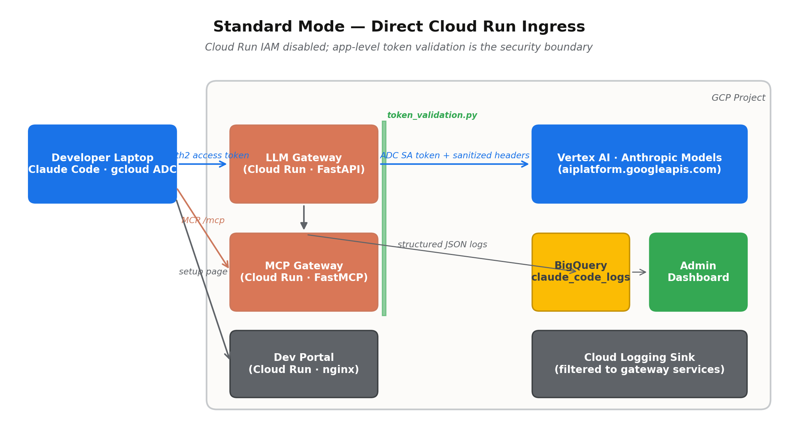
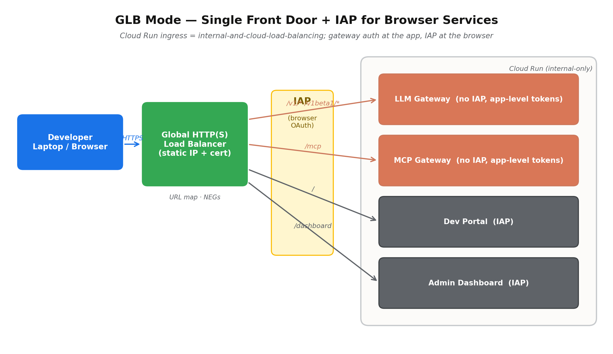
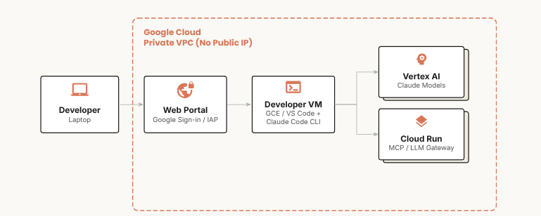
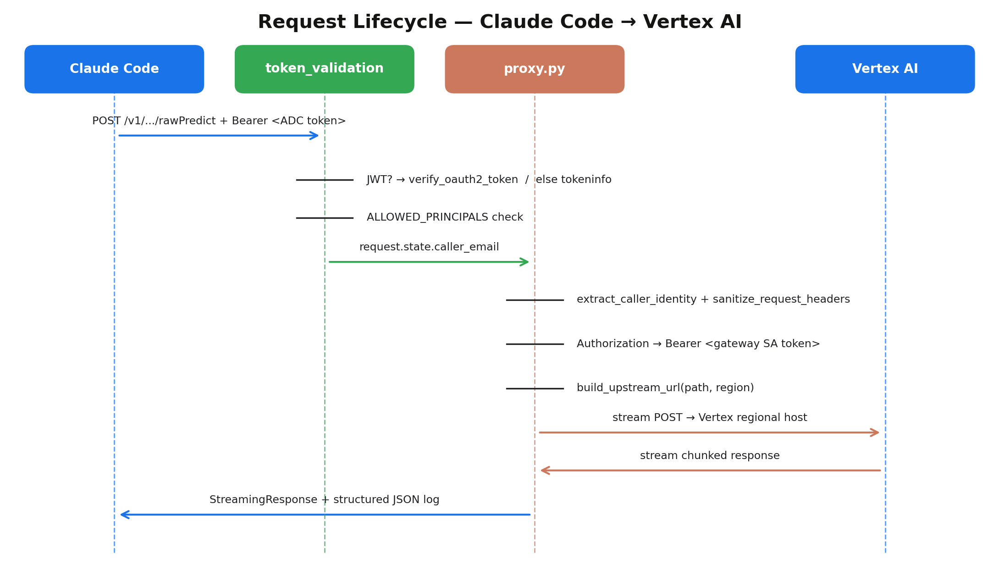

# Claude Code on Google Cloud via Vertex AI — Engineering Design

> Auto-generated from the .docx of the same name (`convert_docx_to_md.py`). Edit the Python generator at `generate_design_doc.py` / `generate_user_guide.py`, then regenerate both .docx and .md.

## 1.  Document Control

This advanced engineering design document accompanies the open-source reference architecture published in the Anthropic × Google Cloud co-innovation repository at 05-solution-accelerators/claude-code-vertex-gcp. It is meant to be a single, self-contained engineering reference that an experienced platform engineer can read end-to-end and walk away with a complete mental model of how the solution is built, why each design choice was made, and how all components interoperate.

#### Revision history

| Version | Date | Author | Notes |
|---|---|---|---|
| 1.0 | April 2026 | Schneider Larbi | Initial publication of the engineering design document for the GLB + hybrid-auth release of the accelerator. |

#### Audience

Cloud platform engineers and security architects responsible for evaluating, deploying, or extending the accelerator inside their own GCP organizations; partner engineers preparing customer-facing demonstrations; and reviewers performing a security or cost analysis prior to production rollout.

#### Scope

- All runtime components (LLM Gateway, MCP Gateway, Dev Portal, Admin Dashboard, Dev VM, Observability pipeline).
- All deployment paths (curl-to-bash, clone+script, Terraform, notebook).
- Authentication, authorization, networking, and observability flows in both Standard and Global Load Balancer modes.
- Operational concerns: cost model, validation strategy, day-2 runbook, extensibility points.

#### Out of scope

- Detailed Anthropic model behavior or prompt-engineering guidance.
- Multi-cloud or non-GCP deployments.
- Customer-specific business-logic MCP tools.

## 2.  Executive Summary

The accelerator delivers a production-quality reference architecture for running Anthropic's Claude Code IDE companion on Google Cloud, with every model inference call routed through Vertex AI rather than the public Anthropic API. The objective is to give security-conscious engineering teams a deployable starting point that meets three constraints simultaneously: no traffic egresses to api.anthropic.com, all caller identity is asserted via Google credentials, and the running cost when idle is effectively zero.

The system is composed of four small Cloud Run services, an optional GCE-based development VM, a Global HTTP(S) Load Balancer (optional), and a BigQuery-backed observability pipeline. The two API-facing services — the LLM Gateway and the MCP Gateway — are deliberately thin: they exist to act as policy enforcement points (caller identity, header sanitation, allow-list enforcement, structured logging) rather than to translate or transform request payloads.

All four deployment paths converge on the same set of GCP resources, and the Terraform module decomposition mirrors the bash deploy scripts one-for-one. The architecture defaults to a hybrid authentication model in which Cloud Run's invoker IAM check is disabled and an application-level token validation middleware accepts both OAuth2 access tokens and OIDC identity tokens — a necessary accommodation given that Claude Code itself sends OAuth2 access tokens, which Cloud Run IAM rejects.

> **WHY:** The decision to disable Cloud Run's invoker IAM check is the load-bearing design choice of the entire system. It is what allows Claude Code (an unmodified third-party CLI) to authenticate against Google-managed infrastructure using nothing more than the developer's existing gcloud Application Default Credentials.

## 3.  Goals, Non-Goals, and Design Principles

### 3.1  Goals

- Allow developers to use the unmodified Claude Code CLI without any custom build or fork.
- Route 100% of model inference through Vertex AI; no traffic to api.anthropic.com.
- Use Google identities everywhere — no shared secrets, no static API keys.
- Cost approximately $0–5 per month when idle so that the architecture can live indefinitely in low-traffic projects.
- Be deployable end-to-end by an engineer who has never opened the Vertex AI console before.
- Provide an honest path from prototype to production — Terraform is a peer of the bash scripts, not an afterthought.
- Surface observable, structured request data so that operators can see who is using Claude, which models, at what error rate, and with what latency.

### 3.2  Non-Goals

- Format translation or payload rewriting between Anthropic and Vertex schemas — Claude Code already emits Vertex-formatted JSON when CLAUDE_CODE_USE_VERTEX=1.
- Multi-tenant, organization-wide gateway with per-team accounting; this is a per-project deployment.
- Ground-up custom IAM policy work — the accelerator deliberately uses standard predefined roles.
- A long-lived caching or retrieval layer in front of Vertex.

### 3.3  Design Principles

- Pass-through over transformation. Every byte that the gateway can forward without inspection is a byte less of attack surface.
- Two layers of defense by default. Where possible the platform (Cloud Run, GLB, IAP) and the application both enforce a control.
- Fail closed. The token validation middleware rejects requests with no Authorization header, with malformed tokens, with revoked tokens, or with valid tokens whose principal is not in the allow-list — in that order, with explicit 401/403 distinctions.
- Idempotent everything. Every shell script, every Terraform module, and every Cloud Run revision deploy is safe to re-run.
- Beginner-friendly comments are a feature. The codebase deliberately favors verbose, didactic comments over terseness because the audience is platform engineers who may have never deployed Cloud Run before.

## 4.  High-Level Architecture

At the highest level, the accelerator is a developer's laptop talking to two thin reverse proxies (LLM and MCP) on Cloud Run, which in turn talk to Vertex AI and to a curated set of GCP APIs. Two browser-facing surfaces — a Dev Portal and an Admin Dashboard — are also deployed, but they are not in the request path of any inference call.

### 4.1  Topology — Standard Mode

Standard mode is the default. Cloud Run ingress is set to all and the platform's invoker IAM check is disabled (--no-invoker-iam-check); the app-level token validation middleware is the security boundary.



*Figure 1 — Standard-mode topology.*

### 4.2  Topology — Global Load Balancer Mode

GLB mode is opt-in (~$18/month additional). It places a single Global HTTP(S) Load Balancer in front of every Cloud Run service. Cloud Run ingress is restricted to internal-and-cloud-load-balancing, and the GLB becomes the only reachable entry point from the public internet. Browser services (Dev Portal, Admin Dashboard) are protected by Identity-Aware Proxy; API services (LLM Gateway, MCP Gateway) keep the same app-level token validation as in standard mode.



*Figure 2 — GLB-mode topology with IAP.*

### 4.3  Topology — Dev-VM-Mediated Mode

Dev-VM-mediated mode is the most isolated deployment shape and a variant of GLB mode rather than a separate code path. The developer's laptop never holds Anthropic credentials, never installs Claude Code locally, and never reaches the gateways directly. Instead, the laptop opens a browser to an IAP-protected web portal (Google Sign-In), which fronts a private GCE VM running Claude Code in a VS Code Server. The VM is the only client of the LLM and MCP gateways, and every component lives inside a private VPC with no public IP.



*Figure 3 — Dev-VM-mediated topology. All compute lives inside a private VPC; the only public surface is the IAP-fronted web portal.*

This shape suits organizations whose laptop fleets cannot install third-party CLIs, whose data-loss-prevention posture forbids outbound LLM traffic from endpoints, or whose security review requires that prompt content never traverse an end-user device. It is enabled by combining `--glb` with the optional `ENABLE_VM=true` deploy flag.

### 4.4  Why Three Modes?

Standard mode is the smallest, cheapest, easiest-to-debug deployment. It satisfies the security review of most engineering organizations because the token validation middleware enforces a hard allow-list of principals. GLB mode addresses the orgs that need a single front door (custom domain, Cloud Armor WAF, IAP for browser auth) and are willing to pay the forwarding-rule cost. Dev-VM-mediated mode addresses the orgs that need to keep Claude Code itself off end-user laptops — moving inference, source code access, and credential surface entirely inside the VPC.

> **NOTE:** All three modes share their security model for API services. They all run with Cloud Run invoker IAM disabled and rely on the app-level middleware. The differences are ingress restriction (none / GLB-only / private-VPC-only), the presence of an IAP-fronted browser path, and where Claude Code runs (laptop vs. Dev VM).

## 5.  Component Catalog

Each component is described with its purpose, the files that implement it, the runtime contract it exposes, and a short narrative of how it interoperates with the rest of the system.

### 5.1  LLM Gateway

A ~150-line FastAPI application that forwards inbound requests to the appropriate Vertex AI regional endpoint. Lives at gateway/app/ and is built into a small container that runs on Cloud Run. The service is intentionally minimal; the entire request handler is implemented in proxy.py and is dominated by header sanitation, ADC token retrieval, and streaming I/O.

#### Files

| File | Role |
|---|---|
| app/main.py | FastAPI application factory; lifespan-managed shared httpx client; catch-all /{full:path} route; /health and /healthz endpoints; conditional registration of token_validation middleware. |
| app/proxy.py | The actual reverse-proxy logic. Builds the upstream URL, sanitizes headers, swaps Authorization for an ADC SA token, streams the request, streams the response back, emits a structured log entry. |
| app/headers.py | Pure-function header sanitation. Drops anthropic-beta*, x-goog-*, hop-by-hop, Authorization, Host, Content-Length, and Accept-Encoding. |
| app/auth.py | Caller-identity extraction from x-goog-authenticated-user-email; ADC-based access token retrieval for outbound Vertex calls; thread-safe credentials cache. |
| app/token_validation.py | Inbound token validation middleware (OAuth2 access token via tokeninfo with 30s TTL cache; OIDC JWT via google.oauth2.id_token.verify_oauth2_token); ALLOWED_PRINCIPALS allow-list enforcement; /health and /healthz bypass. |
| app/logging_config.py | Configures stdout JSON logging that Cloud Logging parses into structured fields. |

#### Runtime contract

- Listens on $PORT (Cloud Run injects 8080).
- Accepts any HTTP method on any /v1/...  or /v1beta1/... path.
- Authorization: Bearer <token> required on every path except /health and /healthz.
- Returns the upstream Vertex response verbatim, including streaming chunked bodies.
- Returns 502 with {error: upstream_unavailable, detail: ...} on httpx network errors.

#### Why it is a pass-through

Claude Code, when started with CLAUDE_CODE_USE_VERTEX=1, already emits Vertex-formatted JSON request bodies — the same anthropic_version: vertex-2023-10-16 envelope that Vertex itself expects. Translating bodies would add a maintenance burden every time Anthropic ships a new field; passing them through means the gateway keeps working through model upgrades with zero code changes.

### 5.2  MCP Gateway

A FastMCP server hosting Model Context Protocol tools that Claude Code can discover and invoke during a session. Implemented in mcp-gateway/server.py as a FastAPI application with the FastMCP ASGI sub-application mounted at /mcp. Ships with a single example tool (gcp_project_info) and provides a documented extensibility path for adding new tools.

#### Why FastAPI in front of FastMCP?

Mounting FastMCP under FastAPI lets the service serve an unauthenticated /health endpoint alongside the protocol endpoint without forking FastMCP. The FastMCP ASGI lifespan is propagated explicitly because Starlette does not auto-forward lifespan events to mounted sub-applications — without this propagation FastMCP's task manager never starts and tool calls fail with task group not initialized.

#### Token validation parity

mcp-gateway/token_validation.py is a verbatim copy of gateway/app/token_validation.py because the two services build separate containers and must run independently. The pre-deploy check script (scripts/pre-deploy-check.sh, 19 checks) verifies the two files are byte-for-byte identical from the first import statement onward; CONTRIBUTING.md calls out this synchronization requirement explicitly.

#### Transport

Streamable HTTP, the March 2025 MCP specification standard. Server-Sent Events transport is intentionally not used — it is now deprecated in the specification.

### 5.3  Dev Portal

A nginx-alpine static site (~10 MB image) that gives developers self-service instructions for pointing Claude Code at the gateway. Cloud Run scales it to zero when not in use. Implemented in dev-portal/.

#### Placeholder substitution at deploy time

public/index.html contains string placeholders that the deploy script substitutes via sed before the docker image is built. The substituted values are baked into the image, so the running container needs no configuration at startup.

| Placeholder | Replacement |
|---|---|
| __LLM_GATEWAY_URL__ | GLB URL when GLB is enabled, else the Cloud Run service URL of llm-gateway. |
| __MCP_GATEWAY_URL__ | GLB URL when GLB is enabled, else the Cloud Run service URL of mcp-gateway. |
| __PROJECT_ID__ | The deploying user's GCP project ID. |
| __REGION__ | The Vertex region (defaults to global). |

#### Twice-deployed in GLB mode

When the GLB is being created, the Cloud Run service must already exist so that the GLB's serverless NEG can point at it. The first deploy of the portal therefore runs before the GLB and bakes Cloud Run URLs into the HTML; once the GLB is created and its IP is known, the deploy.sh orchestrator re-builds and re-deploys the portal with the GLB URL substituted. From the developer's perspective this is invisible.

### 5.4  Admin Dashboard

A small FastAPI service (dashboard/app.py) that serves a Chart.js dashboard displaying gateway request volume, top callers, model distribution, error rate, and latency percentiles. All charts are powered by BigQuery queries against the claude_code_logs dataset.

#### Notable engineering details

- BigQuery table name is auto-discovered (Cloud Logging sinks create date-stamped or stdout-suffixed table names that vary by project) — the discovery query runs against INFORMATION_SCHEMA.TABLES with a 5-minute cache.
- Each chart's query is cached in-process for 30 seconds to keep BigQuery slot usage low when the dashboard auto-refreshes.
- Queries use parameterized BigQuery query parameters (ScalarQueryParameter) — never string concatenation — so the time-window controls cannot be SQL-injected.
- All endpoints degrade gracefully: an empty result returns a JSON note (No log data yet) instead of a 500.

### 5.5  Dev VM (optional)

An optional GCE virtual machine with no public IP, accessed only through Identity-Aware Proxy TCP tunneling (gcloud compute ssh --tunnel-through-iap). The startup script installs Claude Code and, optionally, code-server (browser-based VS Code).

#### Modes

- shared — one VM that all developers use; cheapest option.
- per_user — one VM per principal in allowed_principals (only user: members; group: and serviceAccount: members are skipped). The Terraform module asserts at least one usable principal exists in this mode and fails the plan loudly otherwise.

#### Lifecycle protections

- Shielded VM (secure boot, vTPM, integrity monitoring) is on by default.
- Auto-shutdown after a configurable idle hours threshold (default 2) to bound cost.
- OS Login enabled so developers SSH in as their own Google identity — no shared keypairs.
- boot_disk[0].initialize_params[0].image is on the lifecycle ignore_changes list so Debian image-family bumps do not churn the VM.

### 5.6  Observability Pipeline

Three resources stitched together at deploy time: a BigQuery dataset (claude_code_logs), a Cloud Logging sink that filters Cloud Run logs to the gateway services, and the Admin Dashboard described above. The Admin Dashboard is the canonical observability surface for the accelerator and is the only UI the deploy scripts provision.

#### What gets logged

Every proxied request emits a single structured JSON line at INFO with the following fields:

- caller — the inbound caller's email (from x-goog-authenticated-user-email or token_validation state).
- caller_source — iap, cloud_run, token_validation, or unknown.
- method, path, upstream_host, vertex_region, model, status_code.
- latency_ms_to_headers — wall-clock time from inbound headers to first upstream byte.
- betas_stripped — list of dropped anthropic-beta* header names (for ops who need to track which betas were attempted).
- cloud_run_region, project_id — for cross-project log analysis.

### 5.7  Network Layer

All deployments share a single Terraform-managed VPC named claude-code-vpc with one regional subnet (claude-code-subnet, /24). Private Google Access is enabled on the subnet so that workloads can reach *.googleapis.com without traversing the public internet.

- Two firewall rules permit IAP TCP forwarding (35.235.240.0/20) on tcp:22 and tcp:8080 to instances tagged claude-code-dev-vm only.
- Optional Serverless VPC Connector (cc-run-connector, /28) routes Cloud Run egress through the VPC for orgs that require private egress.
- Optional Private Service Connect endpoint (claude-code-psc-googleapis) provides a private IP for googleapis.com bundled targets — useful when on-prem networks reach the project via Cloud Interconnect.

### 5.8  Global Load Balancer (optional)

When enable_glb=true, a Global HTTP(S) Load Balancer is created with a static IP, a target HTTPS proxy, a URL map, and one Serverless NEG per Cloud Run service that exists. The URL map routes by path:

| Path pattern | Backend |
|---|---|
| /v1/*, /v1beta1/*, /health, /healthz | llm-gateway-backend |
| /mcp, /mcp/* | mcp-gateway-backend |
| / (default) | dev-portal-backend (or llm-gateway-backend if portal is disabled) |

- SSL certificate: Google-managed (when a glb_domain is set and Cloud DNS manages the parent zone; the deploy script auto-creates the A record) or self-signed (when only an IP is available — the developer-setup.sh script then writes NODE_TLS_REJECT_UNAUTHORIZED=0 into ~/.claude/settings.json automatically).
- IAP backends only — Dev Portal and Admin Dashboard. The gateways stay off IAP because Claude Code sends OAuth2 access tokens, which IAP also rejects.
- Cost: ≈ US $18 per forwarding rule per month; data processing is negligible at API-call volumes.

## 6.  Authentication and Authorization Model

This is the most-debated part of the design and the one with the highest blast radius if misunderstood. The accelerator's authentication model is shaped by a single hard constraint imposed by the third-party CLI: Claude Code, when configured to use Vertex AI, sends OAuth2 access tokens. Cloud Run's built-in invoker IAM check accepts only OIDC identity tokens. The two are not interchangeable.

### 6.1  Token Types

| Token type | Format | How Claude Code obtains it | Validated by |
|---|---|---|---|
| OAuth2 access token | Opaque bearer string | google.auth.default() + creds.token via the user's gcloud Application Default Credentials | Google's tokeninfo endpoint (https://oauth2.googleapis.com/tokeninfo) |
| OIDC identity token | JWT, three dot-separated segments | gcloud auth print-identity-token --audiences=<aud> | google.oauth2.id_token.verify_oauth2_token, which checks signature against Google's public keys |

> **WHY:** Cloud Run IAM accepts only OIDC tokens because IAM enforcement happens at the platform's HTTPS edge before the request reaches the container. The platform needs cryptographic proof of identity (a JWT) at that boundary; an opaque access token would require an out-of-band tokeninfo call that Cloud Run does not perform.

### 6.2  Why Cloud Run IAM Is Disabled

Both the LLM Gateway and the MCP Gateway are deployed with two flags that are unusual but deliberate: --no-allow-unauthenticated (which would normally imply Cloud Run IAM enforcement) and --no-invoker-iam-check (which disables that enforcement). The two flags together produce a service that requires authentication but where authentication is performed in the application rather than at the platform.

The trade-off is explicit: the team chose to move the auth boundary one layer inside (FastAPI middleware running in their own container) in exchange for being able to support the unmodified Claude Code CLI. The middleware is small (≈100 lines), tested (test_token_validation.py), and fails closed.

### 6.3  Token Validation Middleware Deep Dive

validate_token_middleware in token_validation.py runs as a FastAPI HTTP middleware. The control flow on every request is:

```
1.  Skip /health and /healthz (so GLB and uptime probes work).
2.  Require Authorization: Bearer <token>; otherwise 401 missing_token.
3.  Detect token type by counting dots: 3 → JWT, otherwise → opaque.
4.  JWT path: id_token.verify_oauth2_token → email claim.
    Opaque path: GET tokeninfo?access_token=<t>; cache for 30s.
5.  If verification returns no email: 401 invalid_token.
6.  If ALLOWED_PRINCIPALS is set and email not in it: 403 forbidden.
7.  Stash request.state.caller_email and caller_source.
8.  Call the next middleware/handler.
```

> **TIP:** The 30-second TTL cache on tokeninfo lookups bounds the per-request latency cost: a cold token costs one HTTPS round-trip; a warm one is a dict lookup. The cache is a simple cachetools.TTLCache, sized at 1024 entries.

### 6.4  ALLOWED_PRINCIPALS Allow-list

ALLOWED_PRINCIPALS is a comma-separated list of identities (emails or service account emails) that are allowed past the middleware. The list is loaded from the env var on container startup and frozen into a frozenset, so lookup is O(1) and the value is immutable for the life of the revision. Members can be plain emails or fully-qualified IAM members (user:foo@example.com); the loader strips the prefix and lower-cases the email before insertion.

When ALLOWED_PRINCIPALS is empty, any valid Google token is accepted. This default is convenient for solo deployments but the Terraform module and bash deploy scripts always populate it from the configured allowed_principals list, so the empty case is hit only in local-dev runs.

### 6.5  Service Account Topology

Each long-running service has a dedicated service account, scoped to the minimum roles it needs:

| Service Account | Roles | Purpose |
|---|---|---|
| llm-gateway | roles/aiplatform.user, roles/logging.logWriter | Calls Vertex AI on behalf of the gateway; writes structured logs. |
| mcp-gateway | (tool-specific roles only) + roles/logging.logWriter | The base SA has only logWriter; tools add roles as needed (e.g. roles/serviceusage.serviceUsageViewer for gcp_project_info). |
| claude-code-dev-vm | roles/aiplatform.user, roles/logging.logWriter | VM-attached SA so developers on the VM can call Vertex through their own ADC if they choose. Also added to ALLOWED_PRINCIPALS in GLB+VM combinations. |
| admin-dashboard | roles/bigquery.dataViewer, roles/bigquery.jobUser, roles/logging.logWriter | Reads from claude_code_logs; submits BigQuery jobs. |

> **NOTE:** Sink writer identities — the system-managed service accounts that the Cloud Logging sink uses to write to BigQuery — are granted roles/bigquery.dataEditor on the dataset. This binding is generated by Terraform from google_logging_project_sink.gateway.writer_identity and by the bash sink deploy script, in both cases scoped to the dataset.

## 7.  Request Lifecycle and Data Flow

The single most important flow in the system is a Claude Code inference request reaching Vertex AI through the LLM Gateway. The sequence below follows one such request from the developer's keystroke to the streamed response.



*Figure 3 — Request lifecycle (Claude Code → LLM Gateway → Vertex AI).*

### 7.1  Step-by-Step

- Claude Code constructs a Vertex-format request and reads the user's ADC access token via google.auth.default().
- It POSTs to ${ANTHROPIC_VERTEX_BASE_URL}/projects/<p>/locations/<r>/publishers/anthropic/models/<m>:rawPredict — note the missing /v1/ prefix.
- Cloud Run accepts the connection (invoker IAM disabled) and routes to the gateway container on port 8080.
- FastAPI matches the explicit /health route first; on miss it falls through to the catch-all /{full:path} route.
- validate_token_middleware fires: detects token type by dot count, verifies it (JWT verify or tokeninfo), enforces ALLOWED_PRINCIPALS, stashes caller_email on request.state.
- proxy.proxy_request reads request.body(), calls extract_caller_identity (which finds the email already on request.state), runs sanitize_request_headers to drop anthropic-beta*, x-goog-*, hop-by-hop, Authorization, Host, etc.
- auth.get_vertex_access_token returns a fresh ADC token for the gateway's own SA (cached, refreshed on demand).
- build_upstream_url normalizes the path (prepends /v1/ if missing), parses out the Vertex region from /locations/<r>/, and selects the right regional host (e.g. us-east5-aiplatform.googleapis.com or aiplatform.googleapis.com for global).
- httpx.AsyncClient issues the upstream request with stream=True and yields a StreamingResponse to FastAPI; the bytes flow back to Claude Code chunk-by-chunk.
- A single structured INFO log line is emitted with caller, model, region, status, latency_ms_to_headers, and betas_stripped.
- When the response stream is fully consumed, a Starlette BackgroundTask closes the upstream httpx response, returning the connection to the pool.

### 7.2  MCP Tool Invocation Flow

Claude Code's MCP client posts JSON-RPC payloads to the MCP Gateway's /mcp endpoint. FastMCP performs the protocol handshake (initialize, tools/list, tools/call) over the same TCP connection. Tool handlers are regular Python functions decorated with @mcp.tool(); their docstrings and type hints are exposed as the schema Claude sees.

### 7.3  Browser Flows

In standard mode the Dev Portal and Admin Dashboard rely on Cloud Run IAM (roles/run.invoker) for browser auth. In GLB mode the same services are fronted by IAP, which performs the OAuth dance and injects x-goog-authenticated-user-email into the upstream request — the same header that extract_caller_identity reads for logs.

## 8.  Deployment Architecture

Four distinct deployment paths converge on the same cloud-side state. The value of having four is that it lowers the cognitive cost for any single team: a security-conscious org runs Terraform, a curious individual pipes the bootstrap script through bash, an internal demo runs the notebook.

### 8.1  The Four Paths

| Path | When to use | Mechanism |
|---|---|---|
| curl-to-bash | Quickest possible kick-the-tires. | Single-line curl … \| bash invocation; deploy.sh self-bootstraps by cloning the repo to a temp dir and re-execing from there. |
| clone + script | Recommended default. | git clone, cd scripts, ./deploy.sh; same code as path 1, just a local copy you can audit and re-run. |
| Terraform | Teams already standardized on IaC. | Two-phase apply: phase 1 with placeholder hello image; phase 2 builds the real images via the deploy scripts and Cloud Run picks them up. |
| Notebook | Live demos / Vertex Workbench environments. | 01-tutorials/claude-code-vertex-gcp/deploy.ipynb is fully self-contained — every Python file, Dockerfile, and HTML asset is embedded. |

### 8.2  Terraform Module Decomposition

The root module main.tf wires every component module conditionally based on enable_* booleans. The variable names mirror the components: block in config.yaml one-for-one, so the bash deploy script and the Terraform path share their mental model.

| Module | Contents |
|---|---|
| network | VPC, subnet with PGA, IAP firewall rules, optional VPC Connector, optional PSC. |
| llm_gateway | Cloud Run v2 service, dedicated SA, IAM for Vertex + log writing. |
| mcp_gateway | Cloud Run v2 service, dedicated SA, IAM. |
| dev_portal | Cloud Run v2 service for the static page. |
| dev_vm | GCE VM (shared or per-user), startup-script template, SSH/IAP IAM. |
| observability | BigQuery dataset, log sink, sink-writer IAM. |
| glb | Static IP, NEGs, backend services, URL map, SSL certificate, target HTTPS proxy, forwarding rule, IAP brand and client. |

### 8.3  Two-Phase Image Pattern

Each gateway module has an image variable that defaults to us-docker.pkg.dev/cloudrun/container/hello when empty. Phase 1 of terraform apply creates Cloud Run services running the placeholder; phase 2 builds the real container via gcloud builds submit and either rewrites the Cloud Run service directly (the bash scripts) or has Terraform pick up the new tag through tfvars (the IaC-purist path).

> **NOTE:** lifecycle.ignore_changes on client and client_version prevents Terraform from rolling back a freshly-pushed image just because some other field drifted. To make Terraform the single source of truth, remove that block and pin *_image to immutable digests in tfvars.

### 8.4  Idempotency

Every deploy script is safe to re-run. Service accounts, Artifact Registry repos, BigQuery datasets, and Cloud Logging sinks are all checked-then-created. Cloud Run handles duplicate deploys natively by issuing a new revision. Terraform apply is idempotent by definition.

### 8.5  Mixing Paths is Hazardous

> **RISK:** Running terraform apply after the bash dev-vm script (or vice versa) will detect that the VM lives in the default VPC instead of the TF-managed claude-code-vpc and propose recreating it — which destroys the boot disk. The script header explicitly warns about this. Migration path: run scripts/teardown.sh first, then choose one path and stick to it.

## 9.  Networking Deep Dive

The network is built from a single VPC and a single regional subnet, with two optional add-ons (VPC Connector, PSC) that handle the long tail of compliance and connectivity requirements.

### 9.1  VPC and Subnet

- claude-code-vpc — auto_create_subnetworks=false; the user-controlled subnet is the only one.
- claude-code-subnet — 10.100.0.0/24 in the chosen region; private_ip_google_access=true.
- Private Google Access is what makes Vertex calls free of public-internet hops without requiring the VPC connector.

### 9.2  IAP Firewall Rules

Two ingress rules permit Google's IAP TCP forwarding range (35.235.240.0/20) to reach instances tagged claude-code-dev-vm:

| Rule | Port | Purpose |
|---|---|---|
| allow-iap-ssh | tcp:22 | gcloud compute ssh --tunnel-through-iap (developer SSH access). |
| allow-iap-web | tcp:8080 | Browser-based code-server when install_vscode_server=true. |

### 9.3  Optional VPC Connector

cc-run-connector is a Serverless VPC Access connector on a /28 sub-range (10.100.1.0/28) that lets Cloud Run egress traverse the VPC instead of Google's default serverless egress. Costs ~$10/month from the minimum billed instance. Use_vpc_connector defaults to true in Terraform but is off in the bash defaults to keep idle cost minimum.

### 9.4  Optional PSC

claude-code-psc-googleapis is a Private Service Connect endpoint with the all-apis target. It exposes a private VPC IP for the entire googleapis.com bundle. Useful when on-prem networks reach the project via Cloud Interconnect and want to keep the API plane off the public internet — otherwise leave it off and save ~$7–10/month.

### 9.5  Network selection for the optional Dev VM

The gcloud-only deploy path lands the dev VM on the project's default VPC by default and idempotently auto-creates that VPC if it is missing. Customers who must route the VM through an existing custom VPC can override this at deploy time without modifying scripts.

| Variable | Default | Behavior |
|---|---|---|
| NETWORK_NAME | default | VPC the dev VM is attached to. The script auto-creates the network only when it equals 'default'; for any custom name the script fails fast if the network is missing — it never creates a customer-named VPC. |
| SUBNET_NAME | (empty) | Required when NETWORK_NAME is a custom-mode VPC. Looked up against FALLBACK_REGION at preflight time. |
| SKIP_NAT | false | Skip provisioning Cloud Router and NAT when the customer's VPC already has its own NAT. Avoids duplicate NAT resources. |

The Terraform path (terraform/modules/network) does not consume these variables — it deliberately creates its own dedicated claude-code-vpc with Private Google Access enabled and a Cloud Router + NAT for the dev VM. Operators choosing the IaC path who need to bind the deployment to an existing VPC should clone the network module and replace the google_compute_network resource with a data source pointing at their VPC. This is documented as a follow-up customisation in the user guide.

> **NOTE:** These overrides are inert when ENABLE_VM is false (the default). The four Cloud Run services do not require VPC selection — they use the Cloud Run platform's default networking unless use_vpc_connector is enabled.

## 10.  Observability Deep Dive

### 10.1  The Pipeline

Three resources stitched together end-to-end:

- BigQuery dataset claude_code_logs (regional, partitioned tables).
- Cloud Logging sink claude-code-gateway-logs filtered to resource.labels.service_name=~^(llm-gateway|mcp-gateway)$.
- Sink writer identity granted roles/bigquery.dataEditor on the dataset (the only IAM hop required).

### 10.2  Why BigQuery, not Cloud Logging Alone

Cloud Logging is excellent for live troubleshooting but expensive to query for time-series aggregates. BigQuery, with the sink configured for use_partitioned_tables=true, gives the admin dashboard cheap APPROX_QUANTILES and GROUP BY date queries on tiny daily partitions. Storage is bounded by default_partition_expiration_ms which, in Terraform, defaults to log_retention_days × 1 day.

### 10.3  Dashboard Queries

Each dashboard endpoint is a parameterized BigQuery query against the auto-discovered table. The set of endpoints is tight on purpose:

| Endpoint | Question it answers |
|---|---|
| /api/requests-per-day | Are people using this? |
| /api/requests-by-model | Which models? |
| /api/top-callers | Who is using the most? |
| /api/error-rate | Are we failing? |
| /api/latency-percentiles | How fast? |
| /api/recent-requests | What just happened? |

### 10.4  Looker Studio (advanced reference, not provisioned)

A markdown walkthrough at observability/looker-studio-template.md documents how an operator could manually wire a Looker Studio dashboard against the same claude_code_logs BigQuery dataset. This guide is provided strictly as a reference for teams that have an established Looker workspace and want to embed gateway telemetry into it; it is not invoked by any deploy script, no prompt asks the operator about Looker at deploy time, and no Looker resource is created. The Admin Dashboard described in section 5.4 is the supported observability UI and renders the same panels with no additional setup. The vast majority of deployments will never touch the Looker reference.

## 11.  Security Posture

Security in this system is layered. No single control is load-bearing on its own; the design assumes any one of them might be misconfigured and leans on the others to fail safe.

### 11.1  Defense Layers

| Layer | Control | Failure mode |
|---|---|---|
| Network | Standard mode: ingress=all but no public IP on the VM. GLB mode: ingress=internal-and-cloud-load-balancing. | Misconfigured ingress fails open in standard mode → caught by app-level token validation. |
| Platform | Cloud Run --no-invoker-iam-check is the deliberate exception; for portal/dashboard in standard mode, IAM enforces invoker. | Disabled invoker IAM is documented and required by the design. |
| Application | token_validation.py middleware: token signature (JWT) or revocation (tokeninfo) + ALLOWED_PRINCIPALS allow-list. | Fails closed; missing/invalid/forbidden each return distinct status codes. |
| Egress | Outbound auth uses ADC SA token (not the caller's token); inbound Authorization header is dropped before forwarding. | An attacker who somehow forged the inbound token cannot use it against Vertex — the gateway's SA is the only identity Vertex sees. |
| Header | anthropic-beta*, x-goog-*, Authorization, Host, Content-Length, Accept-Encoding, hop-by-hop are all dropped. | Belt-and-suspenders for callers who do not set CLAUDE_CODE_DISABLE_EXPERIMENTAL_BETAS=1. |
| Logging | Body is never logged. Only metadata: caller, method, path, model, status, latency. | User source code never lands in BigQuery. |

### 11.2  Notable Properties

- No static API keys anywhere. Every call uses Google identities.
- No public IP on the dev VM.
- No secret stored in any container image. The portal HTML's URL placeholders are public information by design.
- token_validation.py is deliberately copy-pasted between gateway/ and mcp-gateway/. The pre-deploy check enforces parity.
- OAuth consent screen (IAP brand) is created with prevent_destroy=true so a careless terraform destroy cannot delete it.

### 11.3  Threat Model Notes

The architecture explicitly assumes a trusted-corporate-developer threat model. It is not designed to defend against a malicious developer with valid Google credentials and a legitimate spot in ALLOWED_PRINCIPALS — such an actor can issue arbitrary inference requests and consume budget. Per-user rate limiting (Cloud Armor, or a Redis token bucket inside the gateway) is documented as an extension point.

## 12.  Cost Model

The architecture optimizes aggressively for idle cost. Cloud Run scales to zero, the dev VM auto-shuts-down, BigQuery storage is capped via partition expiration, and the gateway containers are tiny (512 MiB / 1 vCPU).

| Configuration | Idle/Light estimate |
|---|---|
| Default, idle (LLM + MCP gateway + portal, no VM, PGA only) | ≈ US $0–5 / month |
| Default, light use (a few developers) | ≈ US $10–30 / month (Vertex tokens dominate) |
| Everything on (incl. e2-small VM, observability) | ≈ US $25–50 / month |
| + GLB (any of the above) | + ≈ US $18 / month forwarding rule |
| + VPC Connector | + ≈ US $10 / month |
| + PSC endpoint | + ≈ US $7–10 / month |

> **NOTE:** Vertex token costs are billed to the deploying project, not to Anthropic. They follow Google's published Vertex AI generative pricing. The accelerator's cost figures explicitly exclude inference token cost because it is workload-dependent — a five-developer team running heavy refactor sessions can easily eclipse the infrastructure cost by 100×.

## 13.  Validation and Testing

Three test surfaces, each calibrated for a different point in the deploy/operate lifecycle.

### 13.1  Pre-deploy (static)

- scripts/pre-deploy-check.sh — 19 checks, no GCP credentials needed.
- Verifies token_validation.py byte-equivalence between gateway and mcp-gateway.
- Confirms middleware registration in main.py and server.py.
- Asserts deploy script GLB conditionals match Terraform variable wiring.
- Confirms teardown coverage for every resource the deploy scripts create.

### 13.2  Post-deploy end-to-end

- scripts/e2e-test.sh — 7 layers, 3 tiny Haiku inference requests (≈ $0.003 total).
- Layers: infrastructure sanity, direct Vertex reachability, gateway proxy behavior, MCP tool invocation, dev VM verification, negative tests, GLB-specific.
- --quick option runs 5 smoke tests in <30 seconds.

### 13.3  GLB-specific

- scripts/validate-glb-demo.sh — 31 tests across 8 layers.
- Covers GLB infrastructure, Cloud Run config, auth flows (access tokens, OIDC, rejection), URL map routing, dev VM integration, IAP bindings, MCP through GLB, bash/Terraform parity.
- GLB URL is auto-discovered via the static IP or GLB_DOMAIN env var.

## 14.  Operations and Day-2 Runbook

### 14.1  Deploy

```
./scripts/deploy.sh
# answer prompts; review printed config.yaml; confirm.
```

### 14.2  Connect Claude Code from a developer laptop

```
./scripts/developer-setup.sh
# auto-discovers gateway URL; writes ~/.claude/settings.json.
```

### 14.3  Demo prep

```
./scripts/seed-demo-data.sh --users 5 --requests-per-user 10
# emits real Haiku requests, hard-capped at 200, ~$0.001 each.
```

### 14.4  Tear down

```
./scripts/teardown.sh
# interactive; requires the project ID typed twice.
```

> **NOTE:** Teardown deliberately preserves the Artifact Registry repo and the BigQuery dataset. Both can be removed manually with gcloud and bq if you really want a clean slate.

### 14.5  Routine operations

- Rotate model versions: edit the Opus/Sonnet/Haiku entries in config.yaml or terraform.tfvars and re-run developer-setup.sh; settings.json picks up the new IDs.
- Add/remove principals: update allowed_principals in config.yaml; re-run deploy.sh (idempotent) — Terraform path: re-apply.
- Switch between standard and GLB mode: re-run deploy.sh with the opposite answer to Deploy Global Load Balancer? — both modes share the same Cloud Run revisions; ingress + IAP toggles change.
- Rebuild the admin dashboard with a code change: re-run scripts/deploy-observability.sh; new revision rolls out automatically.

### 14.6  On-the-fly traffic-policy edits

RATE_LIMIT_PER_MIN, RATE_LIMIT_BURST, ALLOWED_MODELS, and MODEL_REWRITE are environment variables on the llm-gateway Cloud Run service and can be changed without re-running the deploy scripts. Two equivalent surfaces:

| Surface | When to use |
|---|---|
| Cloud Run console (https://console.cloud.google.com/run) | Ad-hoc edits by an operator. Edit & Deploy New Revision → Variables & Secrets tab → set/update env var → Deploy. Audit-log entry naming the human is automatic. |
| gcloud run services update --update-env-vars / --remove-env-vars | Scripted ops, runbooks, CI. |

Cloud Run rolls a new revision on every change (~30 sec rollout). Two side-effects: (1) in-process rate-limit buckets do not survive across revisions, so each caller starts the next minute with a full bucket; (2) Cloud Run admin-activity logs capture both the operator and the diff, so this is auditable for free.

#### Canonical operator runbook — "a model is offline"

When a Vertex regional outage, quota exhaustion, or model deprecation makes one model unavailable, an operator flips MODEL_REWRITE to redirect that model's traffic to a healthy fallback. From the next request, every developer's call to the offline model is silently sent to the fallback; developers do not need to take any action on their laptops. When the upstream issue clears, the operator removes the env var manually — MODEL_REWRITE is deterministic, not self-healing. This is documented in detail in the user guide, section 9.6.1.

> **NOTE:** Automatic failover-on-error (try Opus, fall back to Sonnet on 429/503) is a distinct behavior; see section 15 as an extension point. Not shipped in this package — the manual rewrite path covers planned migrations and short-term outages and avoids the complexity of an async retry layer that would mid-stream a response.

## 15.  Extensibility

The pass-through proxy is intentionally small. Anything heavier belongs in a separate service rather than in proxy.py. With that caveat, the following extension points are anticipated by the design.

### 15.1  New MCP Tools

ADD_YOUR_OWN_TOOL.md walks through a worked example (list_gcs_buckets). The shape: drop a Python module under mcp-gateway/tools/, decorate with @mcp.tool(), import it from server.py, grant the SA whatever role the tool needs, redeploy.

### 15.2  Per-Caller Rate Limiting (shipped)

Implemented in gateway/app/rate_limit.py. An in-process token bucket keyed on the authenticated caller's email enforces a configurable per-minute cap with a separate burst capacity. Disabled by default; enable by setting RATE_LIMIT_PER_MIN to a positive integer (and optionally RATE_LIMIT_BURST). Limit hits return 429 with a Retry-After header set to the seconds until the next token regenerates.

> **NOTE:** Each Cloud Run instance keeps its own buckets, so the effective per-caller limit at high scale is RATE_LIMIT_PER_MIN × N instances. For tight cross-instance enforcement, swap the in-process implementation for a Redis-backed one (Memorystore adds ~$50/month minimum).

### 15.3  Model Allowlist + Rewrite (shipped)

Implemented in gateway/app/model_policy.py. Two independent controls — an allowlist (ALLOWED_MODELS) that returns 403 for any model outside the configured set, and a rewrite (MODEL_REWRITE) that maps from-model to to-model in the URL path before forwarding. Rewrite happens first, then allowlist is checked against the rewritten model. Both default to off; configure via env on the Cloud Run service or via tfvars on the Terraform path.

| Variable | Effect |
|---|---|
| ALLOWED_MODELS=claude-sonnet-4-6,claude-haiku-4-5 | Reject any other model 403. |
| MODEL_REWRITE=claude-opus-4-6=claude-sonnet-4-6 | Force-replace one model with another in the upstream URL. |

### 15.4  Prompt Auditing (extension point)

Hash the request body in proxy.py and emit the hash in the structured log. Do not log the body itself — it contains user source code.

### 15.5  Cross-instance rate limiting (extension point)

Replace the in-process LRUCache in rate_limit.py with a Memorystore (Redis) backend if exact enforcement across autoscaled instances becomes necessary. The hot path is small enough (one INCR + one EXPIRE per request) that latency impact is negligible. Cost: ~$50/month minimum for the smallest Redis instance.

### 15.6  Per-caller token cap (shipped)

Implemented in gateway/app/token_limit.py. Per-caller bucket sized by TOKEN_LIMIT_PER_MIN counts combined input + output LLM tokens. Pre-charge: input-token estimate (~4 chars/token heuristic) blocks immediately if alone-greater-than-bucket. Post-charge: a tee wrapper around the streaming response (_tee_and_debit in proxy.py) accumulates response bytes (capped at 1 MB), gzip-decompresses if needed, parses Vertex's usage field, and debits the bucket post-completion.

> **NOTE:** First-violator-passes is intentional. A request consuming more tokens than the bucket holds will succeed (the gateway only knows the actual count post-response). The next request from the same caller is blocked. Same trade-off every streaming-LLM gateway makes; the alternative (full pre-charge) would buffer the entire response and break Claude Code's streaming UX.

### 15.7  Dashboard Settings tab (shipped)

The Admin Dashboard exposes a Settings tab — scoped to the six traffic-policy environment variables only — that lets a designated editor change values from the same UI used to view telemetry. Implementation:

| Concern | How it's handled |
|---|---|
| Auth | EDITORS env var on the dashboard service is a CSV allowlist. Default empty = read-only. The dashboard reads the IAP-injected x-goog-authenticated-user-email header to identify the caller. |
| Authorization | The dashboard's SA holds three narrowly-scoped roles: roles/run.developer on the llm-gateway service (not project-wide), roles/iam.serviceAccountUser on the llm-gateway runtime SA (needed for revision rollout), and roles/artifactregistry.reader on the AR repo (needed for the new revision to pull its image). |
| Validation | Server-side, mirroring the same shape checks preflight.sh runs (positive integers for limits, CSV format for ALLOWED_MODELS, from=to format for MODEL_REWRITE). |
| Audit | Cloud Run admin-activity log captures the dashboard SA as the principal of the underlying mutation; the dashboard ALSO emits a separate policy_change WARNING-level log entry naming the human editor and the diff. Two-trail provenance. |
| Blast radius | The set of editable variables is a hard-coded frozenset. Even an editor cannot change CPU, memory, scaling, ingress, or IAM through this UI. |

## 16.  Risks, Tradeoffs, and Future Work

### 16.1  Known Tradeoffs

- Disabling Cloud Run invoker IAM is a deliberate and well-documented exception; teams whose policy forbids --no-invoker-iam-check should run Claude Code through a wrapper that mints OIDC identity tokens.
- The pass-through design forwards request bodies untouched. Vendor schema drift between Anthropic and Vertex would surface as upstream errors, not gateway errors.
- Cost optimization for idle prioritizes scale-to-zero, which trades a small first-request latency penalty (cold start) for the $0/month idle figure.

### 16.2  Identified Risks

- Mixing deployment paths can recreate the dev VM and lose its boot disk. Mitigation: explicit warning in the script header; teardown.sh required before path switch.
- Self-signed cert in IP-only GLB mode requires NODE_TLS_REJECT_UNAUTHORIZED=0 client-side. Mitigation: developer-setup.sh writes this only when it detects an IP-based URL; it removes the env var when a domain-based URL is configured.
- Token validation cache (30s) can briefly accept a token in the seconds after revocation. Mitigation: aggressive TTL keeps the window small; ALLOWED_PRINCIPALS is checked on every request and is not cached.

### 16.3  Future Work

- First-class per-user quotas with a small Redis backend.
- Per-tenant model allow-lists driven by Cloud Identity groups.
- An optional caching layer (Cloud Memorystore) for repeat prompts in the same session.
- An audit-only mode that logs request body hashes and tool-call schemas.

## 17.  Appendix A — Environment Variables

| Variable | Component | Purpose / Default |
|---|---|---|
| PORT | All Cloud Run services | Listen port. Set by Cloud Run; default 8080. |
| GOOGLE_CLOUD_PROJECT | LLM Gateway, Dashboard, Tools | Project ID; set by Cloud Run. |
| VERTEX_DEFAULT_REGION | LLM Gateway | Fallback Vertex region when the request path does not encode one. Default global. |
| VERTEX_PROJECT_ID | LLM Gateway | Override for GOOGLE_CLOUD_PROJECT in logs. |
| ENABLE_TOKEN_VALIDATION | LLM Gateway, MCP Gateway | 1 to enable token_validation middleware. Always 1 in production. |
| ALLOWED_PRINCIPALS | LLM Gateway, MCP Gateway | Comma-separated emails or IAM members allowed past the middleware. Empty means any valid Google token is accepted (local dev only). |
| GATEWAY_VERSION | LLM Gateway | Optional override for /health response. Useful when pinning images to a git SHA. |
| BQ_DATASET | Admin Dashboard | BigQuery dataset name. Default claude_code_logs. |
| CLAUDE_CODE_USE_VERTEX | Claude Code (laptop) | 1 to enable Vertex-format requests. |
| CLOUD_ML_REGION | Claude Code (laptop) | Vertex region the client targets. |
| ANTHROPIC_VERTEX_PROJECT_ID | Claude Code (laptop) | Project that owns the Vertex calls. |
| ANTHROPIC_VERTEX_BASE_URL | Claude Code (laptop) | URL of the LLM Gateway (GLB or Cloud Run). |
| CLAUDE_CODE_DISABLE_EXPERIMENTAL_BETAS | Claude Code (laptop) | 1 client-side suppression of anthropic-beta headers (server-side sanitation backs this up). |
| NODE_TLS_REJECT_UNAUTHORIZED | Claude Code (laptop) | Set to 0 only when the GLB URL is an IP with a self-signed cert. |

## 18.  Appendix B — IAM Bindings

| Member | Role | Resource | Why |
|---|---|---|---|
| llm-gateway SA | roles/aiplatform.user | project | Outbound Vertex calls. |
| llm-gateway SA | roles/logging.logWriter | project | Structured request logs. |
| mcp-gateway SA | roles/logging.logWriter | project | Structured request logs. |
| claude-code-dev-vm SA | roles/aiplatform.user | project | Vertex calls from the VM. |
| claude-code-dev-vm SA | roles/logging.logWriter | project | Startup-script diagnostics. |
| allowed_principals | roles/iap.tunnelResourceAccessor | project | IAP TCP tunnel to the dev VM. |
| allowed_principals | roles/compute.osLogin | project | OS Login on the dev VM. |
| allowed_principals | roles/iap.httpsResourceAccessor | GLB backend services (portal, dashboard) | IAP-fronted browser access. |
| sink writer identity | roles/bigquery.dataEditor | claude_code_logs dataset | Writes log rows from the Cloud Logging sink. |
| admin-dashboard SA | roles/bigquery.dataViewer | project | Reads BQ tables for charts. |
| admin-dashboard SA | roles/bigquery.jobUser | project | Submits BQ query jobs. |

### Glossary

| Term | Meaning |
|---|---|
| ADC | Application Default Credentials. Google's standard credential discovery chain (env var → metadata server → gcloud). |
| GLB | Global HTTP(S) Load Balancer. |
| IAP | Identity-Aware Proxy. Browser OAuth + per-resource ACL in front of Cloud Run/GCE/GKE/etc. |
| MCP | Model Context Protocol. Anthropic's open protocol for tool exposure to LLM agents. |
| NEG | Network Endpoint Group. The L7 load-balancing primitive that points at a Cloud Run service. |
| OIDC | OpenID Connect identity token. A JWT signed by Google. |
| PGA | Private Google Access on a subnet. |
| PSC | Private Service Connect. |
| VPC SC | VPC Service Controls (not used by default in this accelerator). |

### References

- Source repository — github.com/PTA-Co-innovation-Team/Anthropic-Google-Co-Innovation
- Vertex AI Anthropic models — cloud.google.com/vertex-ai/generative-ai/pricing
- Cloud Run authentication — cloud.google.com/run/docs/authenticating/overview
- Identity-Aware Proxy — cloud.google.com/iap/docs
- Model Context Protocol specification — modelcontextprotocol.io
- FastMCP — github.com/jlowin/fastmcp
