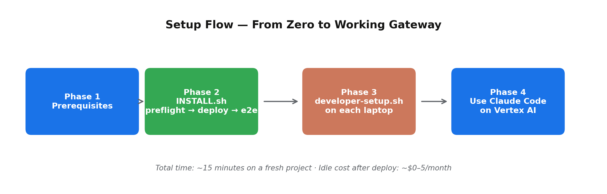
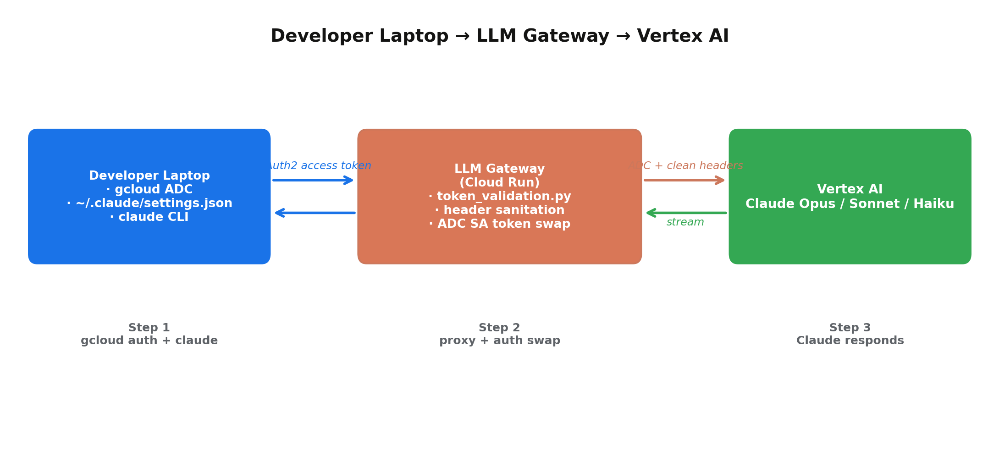
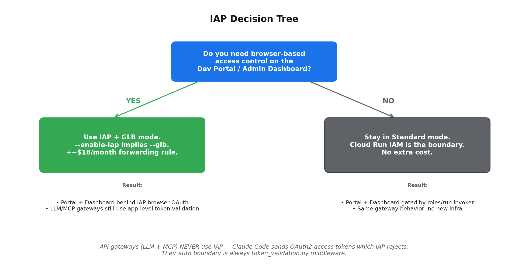
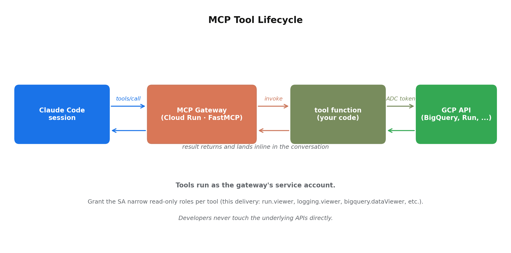

# Claude Code on Google Cloud via Vertex AI — User Guide

> Auto-generated from the .docx of the same name (`convert_docx_to_md.py`). Edit the Python generator at `generate_design_doc.py` / `generate_user_guide.py`, then regenerate both .docx and .md.

## 1.  Welcome

This user guide is the operational companion to the Claude Code on Google Cloud via Vertex AI reference architecture. It walks you through everything you need to do, in order, to take a fresh GCP project from zero to a working gateway that your developers can point Claude Code at. Every command is idempotent — it is always safe to re-run.

If you want to understand the design and why each component is shaped the way it is, read the engineering design document. If you just want it to work, this guide is enough.

#### Who this guide is for

- Platform engineers and architects deploying the accelerator into a Google Cloud project they own.
- Partner-success teams handing the package to an Anthropic / Claude Code customer.
- Developers who just need their laptop pointed at a gateway and don't care how it was deployed.

#### What this guide covers

- Prerequisites — what to enable in your GCP project before installing.
- The single-command installer and what it does in each phase.
- Connecting Claude Code on a developer's laptop.
- Using the Admin Dashboard.
- Configuring IAP for browser services (with concrete fail-modes).
- Adding new MCP tools so your developers' Claude sessions can do more.
- Day-2 operations: rotating principals, scaling out, tearing down.
- Troubleshooting the failure modes we've actually seen.

## 2.  Setup at a glance

Four phases. Total time: about fifteen minutes if everything is configured correctly. The only phase that creates GCP resources is phase 2; phase 1 is just ticking boxes in your project, phase 3 runs on individual developer laptops, and phase 4 is the ongoing usage path.



*Figure 1 — Setup flow.*

## 3.  Phase 1 — Prerequisites

Tick these off in your GCP project before you run the installer. Each one takes under a minute and the preflight script will fail loudly if any are missing.

### 3.1  GCP project with billing

- Create a project at https://console.cloud.google.com/projectcreate or pick an existing one.
- Link a billing account: console → Billing → Linked billing account.
- You need Owner or Editor on the project. The preflight check verifies this for the active gcloud account.

### 3.2  Enable Anthropic Claude models in Vertex AI Model Garden

Open the Model Garden for your project, search for Claude, and click Enable on each model you want to use. The deploy itself succeeds without this step, but inference returns 404 until the models are enabled.

| Model | Vertex Model ID | Required? |
|---|---|---|
| Claude Haiku 4.5 | claude-haiku-4-5@20251001 | Yes — used by the e2e smoke test. |
| Claude Sonnet 4.6 | claude-sonnet-4-6 | Recommended — Claude Code workhorse. |
| Claude Opus 4.6 | claude-opus-4-6 | Recommended — default for hard tasks. |

> **TIP:** Direct link, substituting your project ID: console.cloud.google.com/vertex-ai/model-garden?project=<PROJECT_ID>

### 3.3  Local CLIs

- gcloud — install via the Cloud SDK (cloud.google.com/sdk/docs/install).
- git, python3, curl — usually already on your machine.
- terraform ≥ 1.6 — only required if you choose the IaC path.

### 3.4  Authenticate

```
gcloud auth login
gcloud auth application-default login
gcloud config set project <YOUR_PROJECT_ID>
```

> **NOTE:** Some Cloud Identity / Workspace orgs disable interactive OAuth on test domains. If gcloud auth login throws Error 400 invalid_request, use a service-account key instead: create a SA with Owner, download a JSON key, and run gcloud auth activate-service-account --key-file=key.json. Delete the key once the deploy finishes.

### 3.5  VPC and NAT — defaults and overrides

If you enable the optional Dev VM (it is OFF by default) the deploy script needs a VPC and a Cloud NAT so the VM, which has no public IP, can reach the public internet for apt-get and npm install. The script handles this automatically — but you can override the network it uses if your organisation has VPC policy you must follow.

| Variable | Default | Effect |
|---|---|---|
| NETWORK_NAME | default | Name of the VPC the dev VM lands on. If left as default and the default VPC does not exist, the script auto-creates it (auto-mode subnets, free). If set to a custom name, the script fails loudly if the network is missing — it never creates a customer-named VPC on its own. |
| SUBNET_NAME | (empty) | Regional subnet to attach the VM to. Required for custom-mode VPCs; ignored for auto-mode (the default VPC is auto-mode and gcloud picks the regional subnet automatically). |
| SKIP_NAT | false | Set to true if your VPC already has a Cloud NAT in the deploy region. The script will skip creating its own claude-code-nat-router / claude-code-nat resources to avoid duplicates. |

#### Three example invocations

```
# 1. Default behaviour — uses (and auto-creates) the default VPC.
./INSTALL.sh

# 2. Existing custom VPC, using the customer's own NAT.
NETWORK_NAME=my-corp-vpc \
SUBNET_NAME=my-corp-subnet-us-central1 \
SKIP_NAT=true \
  ./INSTALL.sh

# 3. Existing custom VPC, no existing NAT — let the script add NAT.
NETWORK_NAME=my-corp-vpc \
SUBNET_NAME=my-corp-subnet-us-central1 \
  ./INSTALL.sh
```

> **TIP:** Enable Private Google Access on your custom subnet so that Vertex and other googleapis.com calls stay on Google's private path: gcloud compute networks subnets update <SUBNET> --region=<REGION> --enable-private-ip-google-access

> **RISK:** If the dev VM is OFF (the default), the script does NOT touch VPCs or NAT at all — these settings only matter when ENABLE_VM is true. The four Cloud Run services do not need VPC selection.

## 4.  Phase 2 — Install

### 4.1  The single-command installer

```
tar xzf claude-code-vertex-gateway.tar.gz
cd claude-code-vertex-gateway
./INSTALL.sh
```

INSTALL.sh runs three phases in order. Each writes a log file under /tmp/install-<phase>-<timestamp>.log so you can re-read any output afterwards.

| Phase | What it does | Writes to GCP? |
|---|---|---|
| preflight | ~14 read-only checks: CLIs present, gcloud auth works, project reachable, billing enabled, principal has Owner/Editor, required APIs enableable, Vertex Claude reachable, ALLOWED_PRINCIPALS shape valid, GLB / IAP / dev-VM prereqs as applicable. | No |
| deploy | Enables APIs, creates service accounts and IAM bindings, builds and pushes container images, deploys the Cloud Run services, optionally provisions the dev VM and GLB and IAP. | Yes (idempotent) |
| e2e --quick | Five smoke checks: health endpoints, direct Vertex reachability, gateway proxy round-trip, MCP tool invocation, dev portal up. | No (read-only) |

### 4.2  Useful flags

| Flag | Effect |
|---|---|
| --dry-run | Run preflight, then deploy with --dry-run. No resources created. Skips e2e. |
| --glb | Deploy the Global Load Balancer (~$18/month). Required if you also enable IAP. |
| --yes / -y | Auto-confirm prompts. Useful in CI. |
| --quick | Pass through to e2e — five smoke checks, under 30 seconds. |

### 4.3  Interactive prompts you'll see

- GCP project ID — defaults to the active gcloud project.
- Vertex region — global is the recommended default.
- Components to enable — LLM gateway, MCP gateway, dev portal, observability, dev VM (optional, off by default), GLB / IAP.
- Allowed principals — comma-separated IAM members (user:, group:, serviceAccount:).

## 5.  Phase 3 — Connect Claude Code on a developer laptop



*Figure 2 — Developer laptop request flow.*

### 5.1  Run developer-setup.sh on each laptop

```
./scripts/developer-setup.sh
```

What this does:

- Verifies gcloud is installed and authenticated.
- Runs gcloud auth application-default login if ADC is missing.
- Installs the Claude Code CLI via npm if it isn't already on PATH.
- Auto-discovers the gateway URL — checks GLB IP / domain first, falls back to Cloud Run.
- Writes ~/.claude/settings.json with the right env variables.
- Pings /health on the gateway to prove the round-trip works.

### 5.2  What gets written to settings.json

```
{
  "env": {
    "CLAUDE_CODE_USE_VERTEX": "1",
    "CLOUD_ML_REGION": "global",
    "ANTHROPIC_VERTEX_PROJECT_ID": "<PROJECT_ID>",
    "ANTHROPIC_VERTEX_BASE_URL": "<GATEWAY_URL>",
    "CLAUDE_CODE_DISABLE_EXPERIMENTAL_BETAS": "1",
    "ANTHROPIC_DEFAULT_OPUS_MODEL":   "claude-opus-4-6",
    "ANTHROPIC_DEFAULT_SONNET_MODEL": "claude-sonnet-4-6",
    "ANTHROPIC_DEFAULT_HAIKU_MODEL":  "claude-haiku-4-5@20251001"
  },
  "mcpServers": {
    "gcp-tools": {
      "type": "http",
      "url":  "<MCP_GATEWAY_URL>/mcp/"
    }
  }
}
```

### 5.3  Use it

```
claude
```

If the developer is in ALLOWED_PRINCIPALS and the gateway is healthy, every Claude Code invocation now goes through your gateway → Vertex AI. Nothing in the developer's daily workflow changes from this point — they just use Claude Code as they would with the public Anthropic endpoint.

## 6.  Using the Admin Dashboard

When observability is enabled (default), the deploy creates a Cloud Run service called admin-dashboard that serves a live-updating Chart.js dashboard backed by BigQuery. This is the supported observability surface; no Looker setup is required.

### 6.1  Discover the URL

```
gcloud run services describe admin-dashboard \
  --project <PROJECT_ID> --region us-central1 \
  --format='value(status.url)'
```

### 6.2  What you'll see

- Requests per day across the last 30 days.
- Request volume by model (Opus / Sonnet / Haiku).
- Top callers, ranked by request count.
- Error-rate trend across the chosen window.
- p50 / p95 / p99 latency between gateway and Vertex.
- Live feed of the most recent 50 requests with timestamp, caller, model, status, latency.

### 6.3  Sign-in

Standard mode: the dashboard is gated by Cloud Run IAM (roles/run.invoker). Anyone in your allowed_principals can open the URL in their browser and Google's IAM front-end handles the OAuth flow.

GLB+IAP mode: the dashboard is fronted by Identity-Aware Proxy. The OAuth consent screen you configured at deploy time appears on first sign-in. Same principals authorisation applies.

> **TIP:** Data appears about a minute after the first gateway request. If the dashboard says 'No log data yet', send one inference request through the gateway and refresh.

## 7.  Configuring IAP for browser services

Identity-Aware Proxy is Google Cloud's managed reverse-proxy that sits in front of your service and performs a Google OAuth flow against incoming browser requests. In this accelerator, IAP protects the two browser-facing surfaces — the Dev Portal and the Admin Dashboard — when you want production-grade access control on those surfaces.



*Figure 3 — When to use IAP.*

### 7.1  When to enable IAP

- You want a single Google sign-in flow on the Dev Portal and Admin Dashboard.
- Your security team requires browser-based OAuth in front of any internal-tool surface.
- You plan to run the deployment with a custom domain and Google-managed SSL.
- Skip it if you only need API gateways (LLM + MCP). Their auth is the app-level token validation middleware and never IAP.

### 7.2  How to enable it at deploy time

Run the installer with the --glb flag, or answer 'yes' when INSTALL.sh prompts you about IAP for browser services. INSTALL.sh treats IAP as a top-level choice; choosing IAP automatically also enables GLB (the only fully-automated path for IAP today).

```
./INSTALL.sh --glb
```

INSTALL.sh will prompt for:

- SSL certificate mode — Google-managed if you control a DNS domain in Cloud DNS, otherwise self-signed for IP-only access.
- IAP support email — appears on the OAuth consent screen users see at sign-in.
- Allowed principals — already set; IAP automatically grants each principal roles/iap.httpsResourceAccessor on the dev-portal-backend and admin-dashboard-backend.

### 7.3  What deploy-glb.sh creates for IAP

| Resource | Purpose |
|---|---|
| IAP OAuth brand (consent screen) | One per project. Carries the support email you provided. Lifecycle-protected — cannot be programmatically deleted. |
| IAP OAuth client | Holds the OAuth client ID and secret used by the GLB to verify users. |
| roles/iap.httpsResourceAccessor on each principal | Grants browser sign-in access to the dev portal and admin dashboard backends. |
| IAP enabled on dev-portal-backend and admin-dashboard-backend | The actual gating — every request to those backends now passes through IAP. |

### 7.4  First-time consent screen — what users see

- Browser navigates to the dashboard URL.
- Google redirects to the OAuth consent screen — shows the app title 'Claude Code on GCP' and the support email you set.
- User signs in with their Google account. If they're listed in allowed_principals, IAP grants access; otherwise they see a 403 page.
- Subsequent visits skip the consent screen — IAP issues a session cookie scoped to the GLB.

### 7.5  Granting more users access later

```
gcloud iap web add-iam-policy-binding \
  --resource-type=backend-services \
  --service=dev-portal-backend \
  --project=<PROJECT_ID> \
  --member='user:[email protected]' \
  --role='roles/iap.httpsResourceAccessor'
# repeat for --service=admin-dashboard-backend
```

### 7.6  Known failure modes (and what to do)

| Symptom | Cause | Fix |
|---|---|---|
| IAP brand creation FAILED with no detail. | Cloud Identity / Workspace org policy disables programmatic OAuth-consent-screen creation. | Manually create the consent screen at console.cloud.google.com/apis/credentials/consent; pick Internal (Workspace) or External; app name 'Claude Code on GCP'; support email matching --iap-support-email; save; re-run deploy-glb.sh. |
| Sign-in returns 403 page from IAP. | User not in allowed_principals. | Add them via the gcloud iap web add-iam-policy-binding command above. |
| Sign-in loops back to the consent screen. | User's Workspace policy requires admin grant for third-party OAuth clients. | Workspace admin needs to allow-list the OAuth client at admin.google.com → Security → API controls. |
| Managed cert stuck PROVISIONING for >30 minutes. | DNS A record not yet propagated, or Cloud DNS doesn't manage the parent zone. | Verify A record points at the static IP printed by deploy-glb.sh; managed cert provisioning resumes automatically once DNS resolves. |
| IAP says service is unreachable. | Cloud Run ingress not set to internal-and-cloud-load-balancing. | Re-run deploy.sh with --glb; the script sets the right ingress on each service. |

## 8.  Adding MCP tools

The MCP gateway is the place where your organisation hosts shared tools that every developer's Claude Code session can call. The package ships with four tools — sanity-check helpers and operational read-only tools — but the real value comes when you add tools specific to your workflow.



*Figure 4 — MCP tool lifecycle.*

### 8.1  Tools shipped in this package

| Tool | What it does | Underlying API |
|---|---|---|
| gcp_project_info | Returns project_id, project_number, region, count of enabled APIs. | Cloud Resource Manager + Service Usage. |
| list_cloud_run_services | Lists Cloud Run services in the project: name, region, URL, latest-ready revision, deploy timestamp. | run.googleapis.com (v2). |
| recent_gateway_errors | Pulls the last N WARN/ERROR entries from the LLM and MCP gateways. Useful for in-session triage. | logging.googleapis.com (entries:list). |
| gateway_traffic_summary | Aggregates request count, by-model and by-caller breakdowns, error rate, and p50/p95/p99 latency from the BigQuery log dataset. | BigQuery query against claude_code_logs. |

### 8.2  Adding your own tool — the pattern

Roughly ten minutes per tool. The walkthrough is in mcp-gateway/ADD_YOUR_OWN_TOOL.md; the shape:

- Drop a Python module under mcp-gateway/tools/ containing a function with a clear docstring and type hints — Claude reads those as the tool's schema.
- Decorate the wrapper in mcp-gateway/server.py with @mcp.tool() and import the function.
- Grant the gateway service account whatever IAM role the tool needs (e.g., roles/cloudsql.client for a database tool).
- Run scripts/deploy-mcp-gateway.sh — it rebuilds the image and rolls a new Cloud Run revision.

### 8.3  Plausible custom tools to add

- list_gcs_buckets / get_bucket_object — give Claude read access to your team's storage layout.
- describe_cloud_run_service(name) — config + recent revisions for any service in the project.
- query_bigquery_readonly(sql) — bounded ad-hoc analytics, with a hard timeout.
- lookup_internal_doc(query) — calls a Confluence / Drive search API.
- find_jira_ticket(key) — fetches issue details inline.
- recent_deploys(service, hours) — pulls Cloud Build / GitHub Actions history.
> **NOTE:** Every tool runs as the gateway's service account, not the developer's identity. Grant the SA the narrowest IAM role that lets the tool function, and you have a clean audit boundary.

## 9.  Rate limiting and model policy

The LLM Gateway ships with two optional traffic-policy controls. Both are off by default — when unset, the gateway behaves as a pure pass-through. Turn either or both on by setting environment variables on the Cloud Run service or in your terraform.tfvars.

### 9.1  Per-caller rate limit

An in-process token-bucket limiter keyed on the authenticated caller's email. Each caller gets their own bucket; when empty, the gateway returns 429 with a Retry-After header set to the seconds until one more token regenerates. The bucket refills at RATE_LIMIT_PER_MIN per minute and is capped at RATE_LIMIT_BURST.

| Variable | Default | Effect |
|---|---|---|
| RATE_LIMIT_PER_MIN | 0 (disabled) | Per-caller cap, requests per minute. Set to a positive integer to enable. |
| RATE_LIMIT_BURST | = RATE_LIMIT_PER_MIN | Maximum bucket size. Larger than PER_MIN allows short spikes; equal to PER_MIN gives a smooth limit with no burst tolerance. |

> **NOTE:** Each Cloud Run instance keeps its own buckets, so the effective per-caller limit at high scale is RATE_LIMIT_PER_MIN × N instances. Acceptable for typical team sizes (<10 instances). Switch to a Redis-backed limiter if you need exact enforcement across hundreds of concurrent instances.

### 9.1.1  Per-caller LLM-token cap (input + output)

Where the rate limit counts requests, the token cap counts the actual model tokens — the unit Vertex bills on. A developer sending five 80k-token Opus requests pays the same as another sending five 100-token Haiku requests, even though their cost differs by 50×. The token cap is what protects budget; the rate cap is what protects against script abuse.

| Variable | Default | Effect |
|---|---|---|
| TOKEN_LIMIT_PER_MIN | 0 (disabled) | Combined input+output tokens per minute per caller. Set to a positive integer to enable. |
| TOKEN_LIMIT_BURST | = TOKEN_LIMIT_PER_MIN | Maximum bucket size. |

#### How enforcement works

- Pre-check: the gateway estimates the input-token count from the request body (~4 chars per token heuristic). If that alone exceeds the bucket, the request is rejected immediately with HTTP 429 — saving the cost of a Vertex call.
- Post-check: when Vertex returns, the gateway reads the actual usage.input_tokens + usage.output_tokens from the response and debits the bucket. The bucket can go negative.
- Next request from that caller: pre-check fires 429 because the bucket is below the request's input estimate.
> **NOTE:** First-violator-passes: a single request that consumes more tokens than the bucket holds will succeed (the gateway only knows the actual count after the fact). The next request from that caller is blocked. This is the same trade-off every streaming-LLM gateway makes; perfect pre-charge would require buffering the entire response, which would break Claude Code's streaming UX.

### 9.2  Model allowlist

ALLOWED_MODELS is a comma-separated list of Anthropic model names that the gateway will forward. Requests for any other model return 403 with body {"error":"model_not_allowed"}. Use this for cost control (prevent developers using Opus when budget says Sonnet only) or compliance.

```
ALLOWED_MODELS=claude-haiku-4-5,claude-haiku-4-5@20251001,claude-sonnet-4-6
```

> **TIP:** Match is exact on the full model string, including version qualifiers. List every variant your team should be able to use, e.g. both claude-haiku-4-5 and claude-haiku-4-5@20251001 if you want to allow either form.

### 9.3  Model rewrite

MODEL_REWRITE is a comma-separated list of from=to pairs. When a request specifies the from model, the gateway rewrites the URL to target the to model instead — without telling the client. Useful for emergency cost-cuts ('force everyone off Opus to Sonnet immediately') or for migrating a team off a deprecated model without touching every developer's laptop.

```
MODEL_REWRITE=claude-opus-4-6=claude-sonnet-4-6,claude-opus-4-5=claude-sonnet-4-6
```

Order: rewrite happens BEFORE allowlist. So you can rewrite Opus to Sonnet and only allow Sonnet, and rewritten requests will pass cleanly.

### 9.4  Configuring at deploy time — gcloud path

```
export RATE_LIMIT_PER_MIN=120
export RATE_LIMIT_BURST=240
export ALLOWED_MODELS="claude-sonnet-4-6,claude-haiku-4-5,claude-haiku-4-5@20251001"
export MODEL_REWRITE="claude-opus-4-6=claude-sonnet-4-6"
./INSTALL.sh
```

### 9.5  Configuring at deploy time — Terraform path

```
# terraform.tfvars
rate_limit_per_min = 120
rate_limit_burst   = 240
allowed_models     = "claude-sonnet-4-6,claude-haiku-4-5,claude-haiku-4-5@20251001"
model_rewrite      = "claude-opus-4-6=claude-sonnet-4-6"
```

### 9.6  Updating values on a running deployment

Six controls are environment variables on the LLM gateway's Cloud Run service, so you can change them without re-building the container image. Three equivalent ways: the dashboard's Settings tab, the Cloud Run console, or a command line.

#### Option A — the dashboard's Settings tab (single pane of glass)

When observability is enabled and EDITORS is configured, the Admin Dashboard exposes a Settings tab with a form for the six traffic-policy values. Editor allowlist is configured via the EDITORS env var on the dashboard service (CSV of emails). Default empty = read-only — no GUI editing until you explicitly opt in editors.

| Step | What you do |
|---|---|
| 1 | Open the Admin Dashboard URL (printed by deploy or via the gcloud command in section 6.1). |
| 2 | Sign in via your Google account when prompted. |
| 3 | Click the Settings tab. |
| 4 | Update one or more values. Empty fields remove the env var entirely (returns the setting to its default). |
| 5 | Click Save & Deploy New Revision. The dashboard makes the Cloud Run admin API call on your behalf; new revision is live in ~30 seconds. |

> **NOTE:** Two audit trails are created on every change: the Cloud Run admin-activity log (who-was-impersonated-as: the dashboard SA) and a separate policy_change log entry from the dashboard naming the IAP-authenticated human who clicked Save. The second is what you grep when investigating who turned the cap on at 2 AM.

#### Option B — Cloud Run console (recommended for ad-hoc ops)

Click-path for any of the four traffic-policy variables:

- Open https://console.cloud.google.com/run for your project.
- Click the llm-gateway service.
- Click EDIT & DEPLOY NEW REVISION (top of the page).
- Switch to the Variables & Secrets tab.
- Add or change RATE_LIMIT_PER_MIN, RATE_LIMIT_BURST, ALLOWED_MODELS, or MODEL_REWRITE.
- Click DEPLOY at the bottom. New revision is live in ~30 seconds.

#### Option C — gcloud (scripted ops, CI, runbooks)

```
# Set or change a value
gcloud run services update llm-gateway \
  --project <PROJECT_ID> --region us-central1 \
  --update-env-vars 'RATE_LIMIT_PER_MIN=60'

# Remove a value (returns the gateway to its default-disabled state)
gcloud run services update llm-gateway \
  --project <PROJECT_ID> --region us-central1 \
  --remove-env-vars 'MODEL_REWRITE'
```

> **NOTE:** Cloud Run rolls a new revision on every change (~30 sec). Two side-effects to know: (1) in-flight rate-limit buckets are not preserved across the new revision — every caller starts the next minute with a full bucket. (2) An audit-log entry naming the human who made the change lands in Cloud Logging automatically (filter protoPayload.serviceName=run.googleapis.com).

#### 9.6.1  Worked scenario — "Opus is offline, route everyone to Sonnet"

This is the canonical use of MODEL_REWRITE. A model is unavailable (Vertex regional outage, quota burst, or model deprecated) and you need every developer's Opus traffic to land on Sonnet for the next few hours. No developer has to do anything; they keep typing claude as if nothing happened.

Switch:

```
gcloud run services update llm-gateway \
  --project <PROJECT_ID> --region us-central1 \
  --update-env-vars 'MODEL_REWRITE=claude-opus-4-6=claude-sonnet-4-6'
```

From the next request onward, every Opus call is silently rewritten to Sonnet at the gateway. Verify by sending one Haiku-sized test through Opus and inspecting the response's model field — it will show claude-sonnet-4-6 instead of claude-opus-4-6.

When Opus comes back, revert in one command:

```
gcloud run services update llm-gateway \
  --project <PROJECT_ID> --region us-central1 \
  --remove-env-vars 'MODEL_REWRITE'
```

> **TIP:** MODEL_REWRITE is deterministic — every Opus request becomes Sonnet, even when Opus is healthy. So when the upstream outage clears you must remove the rule manually. The gateway does NOT auto-detect Opus health and revert. If you want automatic-on-error behavior, that's failover and is documented in the engineering design doc as an extension point — not shipped in this package.

> **NOTE:** MODEL_REWRITE accepts multiple comma-separated rules, so you can fail multiple models over at once: MODEL_REWRITE="claude-opus-4-6=claude-sonnet-4-6,claude-opus-4-5=claude-sonnet-4-6"

## 10.  Day-2 operations

### 10.1  Add or remove allowed users

```
# pick a delimiter that won't appear inside the value
gcloud run services update llm-gateway \
  --project <PROJECT_ID> --region us-central1 \
  --update-env-vars "^;^ALLOWED_PRINCIPALS=user:[email protected],user:[email protected]"
# repeat for mcp-gateway
```

### 10.2  Rotate model defaults

Edit the Opus / Sonnet / Haiku entries in config.yaml or terraform.tfvars and re-run developer-setup.sh on each laptop. settings.json picks up the new IDs.

### 10.3  Move from standard to GLB+IAP later

Re-run INSTALL.sh and answer 'yes' to the IAP prompt. The deploy is idempotent — existing Cloud Run services are updated in place, ingress flips to internal-and-cloud-load-balancing, and IAP is wired in front. No data loss.

### 10.4  Demo prep

```
./scripts/seed-demo-data.sh --users 5 --requests-per-user 10
```

Issues small Haiku requests on your behalf so the dashboard has something to show. Hard-capped at 200 total. About $0.001 each.

### 10.5  Tear down

```
./scripts/teardown.sh
```

Interactive — you have to type the project ID twice. Removes the gateways, dev VM, NAT, IAP wiring, and IAM bindings. Preserves the BigQuery dataset and Artifact Registry by default; clean those manually if you want a fully-empty project.

## 11.  Troubleshooting

| Symptom | Most likely cause | What to do |
|---|---|---|
| preflight FAIL on Vertex Claude probe | Anthropic models not enabled in Model Garden. | Open Model Garden for the project, click Enable on Haiku 4.5 (and Sonnet/Opus). Re-run preflight. |
| preflight FAIL on billing | Billing not linked. | Console → Billing → Link billing account → re-run preflight. |
| deploy fails on Cloud Build first time | Cloud Build region not yet warmed. | INSTALL.sh is idempotent — re-run it; second run usually completes. |
| IAM propagation race | GCP IAM is eventually-consistent. | Re-run INSTALL.sh. wait_for_sa handles the standard cases; persistent failures clear within 60 seconds. |
| Gateway returns 401 invalid_token | Caller's identity not in ALLOWED_PRINCIPALS, OR an ya29 access-token misclassification (fixed in this package). | Verify ALLOWED_PRINCIPALS includes the caller; check the gateway's revision ID matches the latest pushed image. |
| Gateway returns 403 forbidden | Token verified successfully but caller is not allow-listed. | Add the user via the gcloud run services update command in section 9.1. |
| Gateway returns 404 from Vertex | Model not enabled in Model Garden, or wrong model ID. | Open Model Garden and verify the specific model is enabled; check ANTHROPIC_DEFAULT_*_MODEL settings on the developer's laptop. |
| A specific model is unavailable (Vertex outage / quota / deprecation) | Upstream model issue; not a gateway bug. | Set MODEL_REWRITE=<offline-model>=<fallback-model> on the LLM gateway via Cloud Run console (or gcloud run services update). All requests to the offline model are silently routed to the fallback. See user guide section 9.6.1 for the worked example. Remove the env var when the upstream issue clears. |
| Gateway returns 429 quota exceeded | Vertex AI default quotas hit. | Request a quota bump in Console → IAM & Admin → Quotas. Search 'Vertex AI'. |
| Dashboard shows 'No log data yet' | First gateway request not yet flushed to BigQuery. | Send one request through the gateway, wait ~60 seconds, refresh. |
| IAP brand creation fails silently | Workspace org policy blocks programmatic creation. | See section 7.6 — manual remediation. |
| Dev VM startup-script exit 100 | VM has no internet egress (Cloud NAT missing). Fixed in this package; if it recurs, gcloud compute routers nats describe should show claude-code-nat. | If NAT is missing, re-run deploy-dev-vm.sh — it provisions Router + NAT idempotently. |

## 12.  Appendix — Reference card

### 12.1  Files in the package

| Path | Purpose |
|---|---|
| INSTALL.sh | Single-command installer — preflight → deploy → e2e. |
| scripts/preflight.sh | Read-only validator. ~14 checks. No GCP writes. |
| scripts/deploy.sh | Interactive orchestrator. Calls per-component deploy scripts. |
| scripts/deploy-llm-gateway.sh | Builds + pushes LLM gateway image; deploys Cloud Run service. |
| scripts/deploy-mcp-gateway.sh | Same for the MCP gateway. |
| scripts/deploy-dev-portal.sh | Builds the static portal with placeholders substituted; deploys. |
| scripts/deploy-observability.sh | Creates BQ dataset, log sink, admin dashboard. |
| scripts/deploy-glb.sh | GLB + IAP wiring. |
| scripts/deploy-dev-vm.sh | Optional dev VM, no public IP, accessed via IAP TCP tunnel. |
| scripts/developer-setup.sh | Per-laptop setup. |
| scripts/e2e-test.sh | Post-deploy smoke + sanity tests. |
| scripts/teardown.sh | Interactive teardown. |
| terraform/ | IaC path. Modules mirror the bash scripts one-for-one. |
| mcp-gateway/tools/ | MCP tool sources. Add new tool files here. |

### 12.2  Environment variables on the developer laptop

| Variable | Purpose |
|---|---|
| CLAUDE_CODE_USE_VERTEX | Set to 1 to enable Vertex-format requests. |
| CLOUD_ML_REGION | Vertex region the client targets. |
| ANTHROPIC_VERTEX_PROJECT_ID | Project that owns the Vertex calls. |
| ANTHROPIC_VERTEX_BASE_URL | URL of the LLM Gateway (GLB or Cloud Run). |
| CLAUDE_CODE_DISABLE_EXPERIMENTAL_BETAS | Suppress anthropic-beta headers client-side. |
| NODE_TLS_REJECT_UNAUTHORIZED | Set to 0 only for IP-based GLB URLs with self-signed cert. developer-setup.sh manages this automatically. |

### 12.3  Costs cheat sheet

| Configuration | Estimate |
|---|---|
| Default, idle (LLM + MCP gateway + portal, no VM) | ~$0–5 / month |
| Default, light use (a few developers) | ~$10–30 / month (Vertex tokens dominate) |
| Everything on (incl. dev VM, observability) | ~$25–50 / month |
| + GLB / IAP | + ~$18 / month |
| + VPC Connector | + ~$10 / month |
| + PSC endpoint | + ~$7–10 / month |

### 12.4  Where to file things

- Gateway code bug — upstream repo (github.com/PTA-Co-innovation-Team/Anthropic-Google-Co-Innovation).
- Cloud Run / Vertex / IAM behaviour — Google Cloud Support.
- Claude Code CLI behaviour — github.com/anthropics/claude-code/issues.
- Anthropic model behaviour or quotas — Anthropic enterprise contact.
